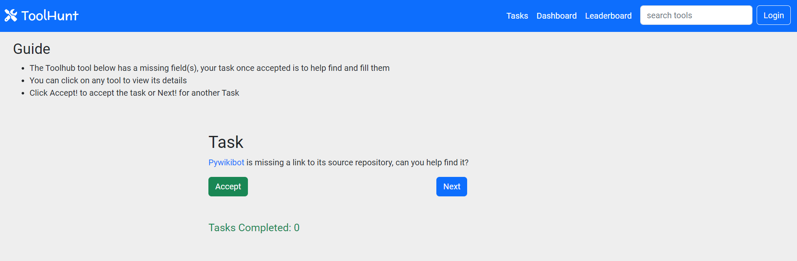
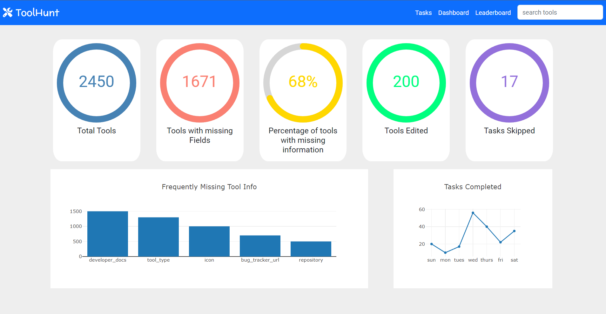
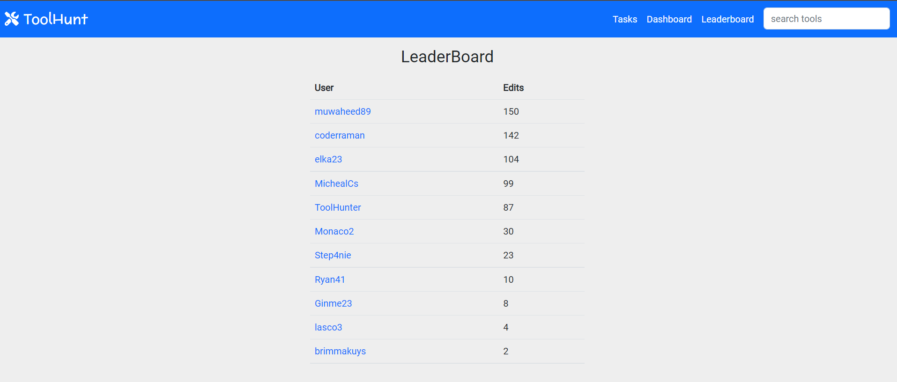

# ToolHunt

### Live Demo: https://muvvahhed.github.io/toolhunt/

### About the App
Toolhunt is a web application for editing Tools (software applications) in the Toolhub (a community managed catalog of software tools used in the Wikimedia movement)

### Technologies
Html5, CSS3, Bootstrap,  Javascript, React

### Setup
* download or clone Repository
* run `install --save react-circular-progressbar` for diagrams
* run `npm install react-plotly.js plotly.js` for charts
* run `npm start` to start app
* run `npm test` to test app

### Dependencies
* react
* react-dom
* react-plotly.js
* react-circular-progressbar
* @testing-library/react
* @testing-library/user-event
* @testing-library/jest-dom

### Usage
#### Landing-Page

This is where the users can login and are assigned tasks where they can Accept, Change, and Skip Tasks

#### Dashoard

This page contains metrics that provides information, insights and more on the Tools and Tasks

#### Leaderboard

Contains the list of the top users and their number of edits